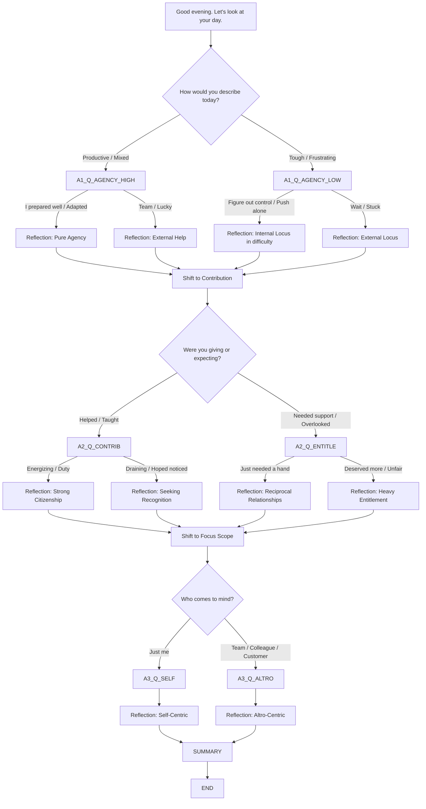

# Reflection Tree Diagram

```mermaid
graph TD
    START[Good evening. Let's look at your day.] --> A1_OPEN
    A1_OPEN{How would you describe today?}
    A1_OPEN -->|Productive / Mixed| A1_Q_AGENCY_HIGH
    A1_OPEN -->|Tough / Frustrating| A1_Q_AGENCY_LOW
    
    A1_Q_AGENCY_HIGH -->|I prepared well / Adapted| A1_R_INT[Reflection: Pure Agency]
    A1_Q_AGENCY_HIGH -->|Team / Lucky| A1_R_EXT_LIGHT[Reflection: External Help]
    
    A1_Q_AGENCY_LOW -->|Figure out control / Push alone| A1_R_INT_LIGHT[Reflection: Internal Locus in difficulty]
    A1_Q_AGENCY_LOW -->|Wait / Stuck| A1_R_EXT[Reflection: External Locus]
    
    A1_R_INT --> BRIDGE_1_2
    A1_R_EXT_LIGHT --> BRIDGE_1_2
    A1_R_INT_LIGHT --> BRIDGE_1_2
    A1_R_EXT --> BRIDGE_1_2
    
    BRIDGE_1_2[Shift to Contribution] --> A2_OPEN
    A2_OPEN{Were you giving or expecting?}
    A2_OPEN -->|Helped / Taught| A2_Q_CONTRIB
    A2_OPEN -->|Needed support / Overlooked| A2_Q_ENTITLE
    
    A2_Q_CONTRIB -->|Energizing / Duty| A2_R_CONTRIB[Reflection: Strong Citizenship]
    A2_Q_CONTRIB -->|Draining / Hoped noticed| A2_R_ENTITLE_LIGHT[Reflection: Seeking Recognition]
    
    A2_Q_ENTITLE -->|Just needed a hand| A2_R_CONTRIB_LIGHT[Reflection: Reciprocal Relationships]
    A2_Q_ENTITLE -->|Deserved more / Unfair| A2_R_ENTITLE[Reflection: Heavy Entitlement]
    
    A2_R_CONTRIB --> BRIDGE_2_3
    A2_R_ENTITLE_LIGHT --> BRIDGE_2_3
    A2_R_CONTRIB_LIGHT --> BRIDGE_2_3
    A2_R_ENTITLE --> BRIDGE_2_3
    
    BRIDGE_2_3[Shift to Focus Scope] --> A3_OPEN
    A3_OPEN{Who comes to mind?}
    A3_OPEN -->|Just me| A3_Q_SELF
    A3_OPEN -->|Team / Colleague / Customer| A3_Q_ALTRO
    
    A3_Q_SELF --> A3_R_SELF[Reflection: Self-Centric]
    A3_Q_ALTRO --> A3_R_ALTRO[Reflection: Altro-Centric]
    
    A3_R_SELF --> SUMMARY
    A3_R_ALTRO --> SUMMARY
    SUMMARY --> END
```
